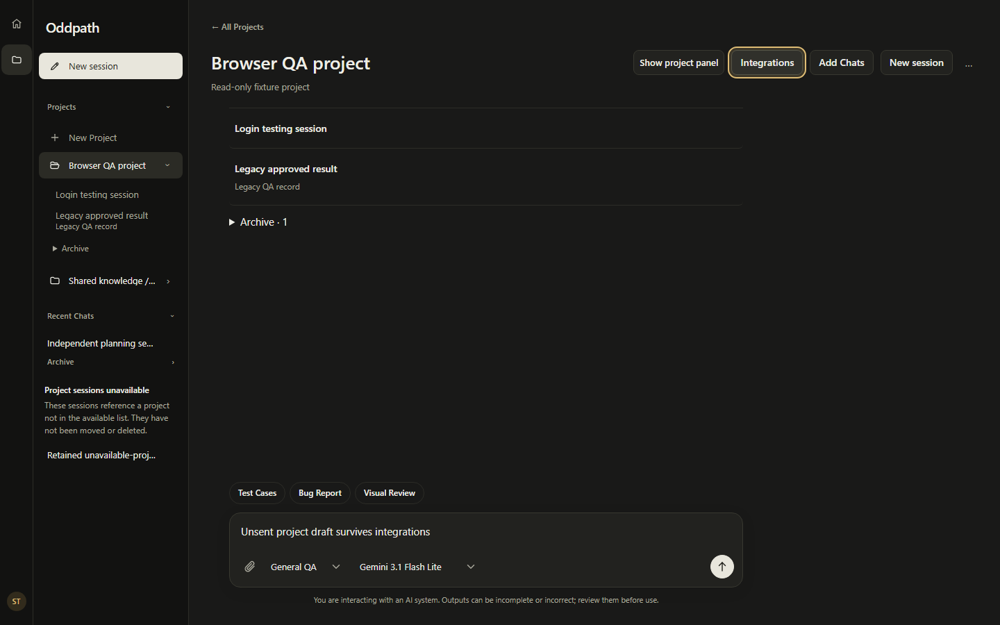
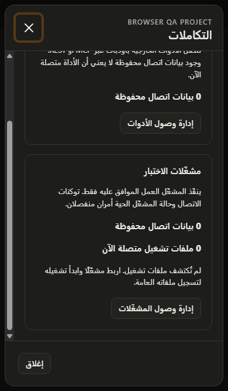

# Session closeout — 2026-10-06

Last resumed/validated: 2026-10-07. The original pre-live results below remain
dated evidence; the post-live authentication follow-up has its own checks.

Bounded follow-up before the owner's separate comprehensive commit/push review.
Work stays local on the existing dirty `main`, preserving earlier implementation.
No staging, commit, push, deployment, new migration or owner QA-record mutation
was performed. The separately approved live follow-up used eight real provider
calls and disposable records only; see `SESSION_LIVE_CLOSEOUT.md`.

## Changes

### Authentication startup follow-up

The live experiment exposed an actionable guest composer while `/auth/me` was
still pending. A quick submission could take the legacy route before the owned
session appeared, discarding its displayed response on the identity transition.
The auth state now distinguishes pending, confirmed guest and failed reads.
Pending/error states gate the composer; failures offer retry/sign-in, and owned
session/project/request links cannot silently fall back to guest submission.
Confirmed unscoped guests retain their normal flow. Stale identity reads cannot
lock a newer login. The legacy submit handlers also enforce the boundary.

### Owned destination recovery

Saved work previously depended on membership in capped sidebar indexes. A valid
older session could be mistaken for a missing destination, and a promoted session
shortcut could discard the selected historical request.

`resolveLastWork` now validates the owned session and selected QA request through
existing detail reads. It preserves `requestId`, infers only an omitted project,
rejects conflicting explicit scope, and handles projectless sessions and unlinked
legacy QA records. Project-only hints use the existing project-instruction read
to verify access; session restoration does not fetch the editing panels.

Confirmed 403/404/410 or incompatible identities return to a clean start. Network,
authentication, throttling and server failures retain a retryable hint rather
than pretending data was deleted. Explicit canonical/legacy links and subsequent
navigation have priority. Account-generation fences reject late results even
after switching A → B → A; an earlier startup cannot mark the new account ready
or overwrite its destination. All of these operations are reads, not adoption,
message submission, preparation or execution.

### Discoverable project Integrations

Open the project's name from a session or navigation, then **Integrations** in
the project header. This action remains visible with project context collapsed.
The existing context-footer button forwards to the same project-owned dialog;
it no longer owns a second modal instance. Project/account changes and leaving
the page close the dialog. Escape restores the invoking header/footer control,
and the unsent project draft remains intact.

Visual inspection found an 8px overlap between the title and close button in
the Arabic phone dialog, caused by physical negative Bootstrap margins. A scoped
logical-margin rule fixes it, retains a 44px close target and allows long titles
to wrap. The browser harness now asserts an actual title/button gap in both
directions, not just absence of document overflow. Existing connection/Runner
contracts and execution approval remain unchanged.

### Documentation and eventual commit contents

The product vision, UX direction, information architecture, handoff, roadmap and
preservation map now distinguish the current one-session product from historical
Chat/QA and Start test decisions. Oddpath complements coding/AI tools through
useful findings, explicit scope, approvals, evidence and durable history; a model,
chat interface or browser controller alone is not its product value.

`LOCAL_ARTIFACT_POLICY.md` records the non-destructive inventory. `work/` and root
`debug.log` are ignored; thousands of generated images and private operational
helpers remain on disk. Maintained scripts, code, tests, migrations and reviewed
documentation remain eligible. This is not a content-level secret audit or an
approval to stage every remaining file. Older `work/` evidence links are local-only.

## Pre-live verification — 2026-10-06

Checks were run sequentially, not concurrently with the browser matrix. These
are fresh results on the preserved working tree, not reused checkpoint totals.

| Check | Result / local-only evidence |
| --- | --- |
| Full `npm run verify` | 1,611/1,611 passed: contract 4, API 979, Runner 18, web 610; zero failed/skipped/cancelled; `work/session-tools-validation/closeout-verify-20261006.log` |
| Types and architecture | All checks included in `verify` passed; architecture checker inspected 284 source and 148 test files |
| Dedicated translations | 8/8 passed; `work/session-tools-validation/closeout-i18n-20261006.log` |
| API, Runner and web production builds | All passed sequentially; `work/session-tools-validation/closeout-build-{api,runner,web}-20261006.log` |
| Focused restoration/project tests | 48/48 passed before full verification |
| Tools, layout and restoration browser matrix | 65/65, zero runtime errors; `work/session-tools-validation/closeout-browser-final-20261006.log` |
| Browser report/images | `work/session-tools-validation/2026-10-06T10-21-23-748Z/` |
| Critical QA browser journeys | 8/8; `work/session-tools-validation/closeout-qa-20261006.log`; images in `work/test-session-validation/2026-10-06T10-20-00-636Z/` |
| Git whitespace/conflict checks | Passed; no staged files; scratch/debug files neither tracked nor offered by the untracked-file inventory |

The 65 browser checks comprise 48 layout combinations and 17 named behavioral
checks (some share one journey). They include saved-session restoration despite
an omitted/failed index, explicit reload of the historical request, and activity
still identifying the separate current request. The eight QA fixtures cover
scope → preparation → exact execution approval → review, discussion during work,
ordinary discussion retaining consent/usage, drafts/attachments, menus, production
and stale-read safety, earlier pending reviews and guarded project moves.

The failed Arabic overlap reproduction is retained separately in
`work/session-tools-validation/2026-10-06T10-21-06-056Z/`; it is not counted as a
pass. The full matrix was rerun after the scoped correction. Earlier interrupted
attempts with a stopped preview or harness assertion corrections are also not
the final acceptance run.

The web build still reports the existing >500kB chunk-size advisory (main chunk
583.45kB, gzip 173.91kB). It was not suppressed; bundle optimization remains a
performance follow-up, not a build failure. Only the validation-owned port 5182
preview was started and stopped. Normal development services and database were
not replaced, reset or terminated. The full verify/build run completed after the
interruption, followed by a clean whitespace/conflict check.

The maintained browser harness intercepts every API/asset request and rejects
external traffic. Its read-only journeys forbid all mutation methods. The
critical QA harness allows only its own in-memory fixture mutations. Neither
uses the owner's account, database, approved QA records, provider or Runner.

The matrix includes light/dark, en/ar/de/RTL and eight viewport pairs:
1440×900, 1024×900, 992×900, 991×900, 390×844, 320×740, 390×667 and 320×568.
Integrations header/footer, Escape/focus, drafts, Sources, Results, account usage,
project Add chats and a clean new session are checked. Browser contexts run
sequentially and Chromium is recycled after six contexts to limit memory use.

### Curated screenshots

These two final images were visually inspected for layout and content. They use
only synthetic project/session names and contain no real account, token or QA
record. Unlike the raw `work/` outputs, they are intended to accompany this doc.
The phone dialog is intentionally scrolled to its Runner controls; its header
and footer remain reachable.




Reproduction with the repository's supported Node and preinstalled Chromium:

```powershell
# Separate terminal. These browser harnesses intercept the API, not real data.
$env:VITE_API_BASE_URL = ''
npm --prefix apps/web run dev -- --port 5182 --strictPort

# Validation terminal; set PLAYWRIGHT_BROWSERS_PATH if the browser is elsewhere.
node apps/web/scripts/session-tools-smoke.mjs
$env:TEST_SESSION_SMOKE_BEHAVIOR_ONLY = '1'
node apps/web/scripts/test-session-smoke.mjs
npm run verify
npm run test:i18n
npm run build:api
npm run build:runner
$env:VITE_API_BASE_URL = 'https://api.oddpath.example'
$env:VITE_R2_ENDPOINT = ''
npm run build:web
git -c core.safecrlf=false diff --check
```

HTTP-route tests and Chromium need permission to access their own local servers
in a restricted execution environment. Do not weaken assertions to bypass that.
The build's dummy API origin is process-only validation configuration, not an
environment-file edit or deployable endpoint.

## Limits and next gate

- The separately authorized live discussion-during-execution/API-restart journey
  is recorded in `SESSION_LIVE_CLOSEOUT.md`: eight additional calls, one run,
  actual overlapping conversation, PASS/intentional FAIL, review, report and
  draft restoration. Its startup/driver failures and read-only timestamp
  correction are disclosed, not counted as clean original passes. This remains
  one bounded local recovery case, not all-provider/production certification.
- No disposable PostgreSQL migration suite was rerun for these navigation,
  presentation and documentation edits; they change no SQL/schema/backend code.
  Earlier activation and database results remain separately dated evidence.
- Actual phone keyboards, assistive-technology use, unassisted first-test
  onboarding, private storage/embedding/email and production readiness are not
  established by Chromium viewport fixtures.
- Structural TEXT evidence presence is not proof that every requested measured
  value was captured. Execution completion, check PASS/FAIL, record approval and
  release permission remain distinct.
- Live browser/takeover, Android, cross-provider independent review and new
  integrations are separate future work. A selected-diff/secret/security review
  and explicit commit/push authorization are still needed before publication.

These boundaries are intentionally retained; a successful local check does not
mean that every launch requirement or future product idea is finished.

## Post-live authentication verification — 2026-10-07

After the separately approved live experiment, the startup guard and seven
unit regressions were added. Following the interruption, the completed process
exit and full log were rechecked: `verify` passed **1,618/1,618** (contract 4,
API 979, Runner 18, web 617), with zero failures/skips. Its log is
`work/session-tools-validation/live-closeout-verify-20261006.log` (the run began
before the date change). Focused auth/shell tests passed **42/42**.

Translations passed **8/8** and the production web build passed; logs are
`live-closeout-i18n-20261007.log` and `live-closeout-build-web-20261007.log` in the
same folder. The existing bundle advisory remains, now **584.55kB / 174.18kB gzip**.
API/Runner source was unchanged by the auth follow-up; their earlier successful
production builds remain the separately dated evidence above.

The eight critical intercepted-API QA browser journeys passed again after the
auth change (`live-closeout-critical-browser-20261007.log`; images in
`work/test-session-validation/2026-10-07T01-44-06-507Z/`). No live provider calls
were made during this regression pass. See `SESSION_LIVE_CLOSEOUT.md` for the
distinct real-provider evidence, including the initial failures and the SQL
timezone correction rather than a falsely clean end-to-end harness exit.

The maintained read-only browser matrix then passed **71/71**, zero runtime
errors: **23 behavioral checks + 48 language/theme/viewport combinations**.
Six new cases exercise held authentication, HTTP 503 plus explicit retry,
confirmed unscoped guests, and gated canonical-session/legacy-QA/project links.
No composer or mutation is possible before identity resolution; recovery keeps
the owned destination. All previous 65 checks remain intact.

Evidence: `work/session-tools-validation/live-closeout-browser-20261007.log` and
`work/session-tools-validation/2026-10-07T01-45-28-043Z/report.json` with 405
screenshots. The two new authentication states, Arabic 320×568 writer and
Integrations dialog, and desktop Results were visually inspected. Screenshots
are not a claim of testing native keyboards or assistive technology.

The full verification exit was zero after the interrupted conversation. Final
Git whitespace checks passed; no files were staged. The owned 5182 preview was
stopped after browser validation. The real audit's processes and database
container were also stopped with data preserved; no further paid calls occurred.
