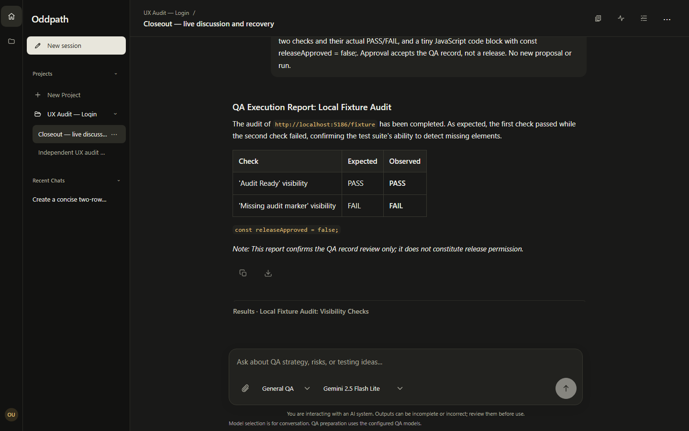

# Live session closeout — 2026-10-06

The owner explicitly authorized up to **eight additional real provider calls**
for this isolated experiment, optionally using a cheaper model. Eight were used;
the previous audit's eight calls remain a separate ledger. Nothing was committed,
pushed, deployed or migrated. The normal development database and the owner's
approved QA records were not used as fixtures.

## What was exercised

Only the disposable `oddpath_ux_review` database on loopback port 55442, the
`UX Audit — Login` project and a new managed session/request were used. API,
web and target fixtures used owned ports 5185, 5184 and 5186. A one-hour Runner
credential was created through the existing connection API, held only in process
memory, then revoked. No existing Runner secret was reused.
All owned live API/web/Runner/target processes were stopped. The disposable
database container was also stopped after verification; its volume and records
were preserved, not deleted.

The real provider proposed two local checks. The real preparation services
generated a checklist, generated a Recipe and reviewed that Recipe. Before
approval the audit checked the actual Recipe: exactly two independent local
navigation/visibility checks, 30-second expectation timeouts, no input, login,
external URL, secrets or side effects. There were no runs before approval.

The browser checked the Recipe acknowledgement and explicitly approved the run.
One heading appears after 20 seconds; the other intentionally never appears.
During that real run a new conversational turn completed. The audit then
restarted only its API process, leaving the Runner and target running. The same
run/job resumed reporting and produced **one PASS, one intentional FAIL and two
TEXT evidence records**. Execution success did not turn the failed check green.

The browser explicitly approved the QA record, requested a final Markdown table
and code example, replayed the same turn ID without adding a message or provider
call, and reloaded an unsent draft. The account usage menu still showed the
server-provided balance. Approval remained about the record, not a release.

### Persisted acceptance

Read-only SQL verified:

- Three managed assistant turns, each successful with one attempt.
- Discussion provider start `20:39:00.156Z`, response saved `20:39:12.812Z`;
  the run started `20:38:58.267Z` and its execution job completed `20:39:50.565Z`.
- The API restart (`20:39:13.185Z` to `20:39:14.773Z`) occurred after that response
  and before completion, retaining the run/job identity with no new approval.
- Exactly one run and an approved request with the original project/session IDs.
- Twenty unique consecutive timeline positions: execution events, discussion,
  saved results, record review, then the final user/assistant exchange.
- The pre-existing isolated QA request's fingerprint remained unchanged.
- All credentials created by these attempts were revoked and temporary audit
  account settings restored. The eight-call ledger survived the API restart.

All times above are UTC. This was one bounded execution/restart case, not proof
of every outage, model, network or production scenario.

## Findings and honest accounting

The first browser-driver attempt matched a guest composer before account loading
finished. Two provider calls went through the legacy path; the managed session
remained empty and no QA request/run was created. These calls are **included** in
the eight-call cap, not hidden or counted as a passing managed journey. Code
inspection confirmed an application startup race, not only an imprecise selector:
a fast submission during slow authentication could lose its displayed response
when the signed-in session replaced the guest view. The follow-up adds a pending/
retry/sign-in boundary before allowing a guest composer and regression coverage;
see the final validation in `SESSION_CLOSEOUT.md`.

The next attempt saved the real proposal but the private driver tried to select
its Runner before the compact decision was expanded. Its evidence is preserved;
the driver resumed that same saved proposal without resending or regenerating it.

The final driver completed its three browser acceptance groups, then its raw-SQL
timestamp comparison failed: node-postgres interpreted Prisma's timezone-less UTC
columns in the host's local timezone, unlike the API's UTC dates. The original
failed report was retained. A separate **read-only** verification used SQL-side
comparisons and explicit UTC conversion, passing five acceptance groups. No
provider call or run was repeated to correct this diagnostic error.

The UI requested `gemini-2.5-flash-lite`; the existing server routing policy
selected **`gemini-3.1-flash-lite` for all eight actual calls**. This audit did not
change model-routing or billing policy. Do not claim the cheaper selection was
honored, or infer paid-provider cost from the UI label. Silently overriding the
visible explicit selection is an unresolved behavior defect, not just a labeling
issue. The owner confirmed this concern on 2026-10-07 and deferred the model/
provider design to a separate conversation. Avoiding Gemini-only product coupling
is the stated direction; removing the selector remains a tentative option, not
an implementation decision. See `NEXT_STEPS.md`; routing remains unchanged here.

## Evidence and limits

Private, ignored local evidence is in `work/live-closeout-20261006/`:
`report.json`, preserved `report-before-*.json` attempts, `provider-calls.json`,
`record-verification.json`, five browser screenshots and sanitized process logs.
No prompts, API key or Runner credential are stored in the provider ledger.

The live screenshot uses only disposable data; the full raw operational folder
is not intended for Git. Private storage, embedding, email, real mobile keyboards,
unassisted onboarding, streaming browser/takeover and production resilience remain
outside this experiment. TEXT evidence presence alone does not establish complete
measured diagnostic evidence. A selected-diff/secret/security review and explicit
authorization are still required before commit/push or publication.
